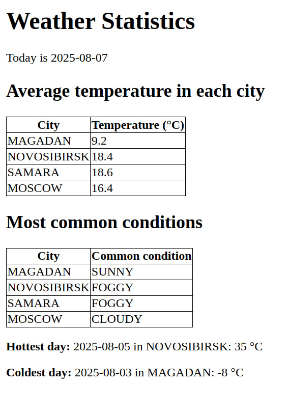

Данный проект - домашнее задание от IT-лагеря T1. Требовалось создать Producer, отправляющий сообщения о погоде в топик Kafka, и Consumer, слушающий сообщения из топика и выводящий на экран статистику.

# Запуск проекта

1. Клонируйте репозиторий
```bash
git clone https://github.com/alinacozy/KafkaWeather.git
```

2. Из корневой папки проекта запустите команду
```bash
docker compose up
```

- Страничка с собранной статистикой будет доступна по адресу: http://localhost:8081/stats
- Также будет доступен Kafdrop: http://localhost:9000

## Вид странички с собранной статистикой: 



Отсчет даты начинается с дня, когда вы запускаете проект. Каждые 10 секунд producer генерирует погоду в четырех городах, и проходят одни сутки. На странице отображена "текущая" дата - последняя дата, информация о которой прослушал consumer, а также статистика за все записи о погоде до этой даты.